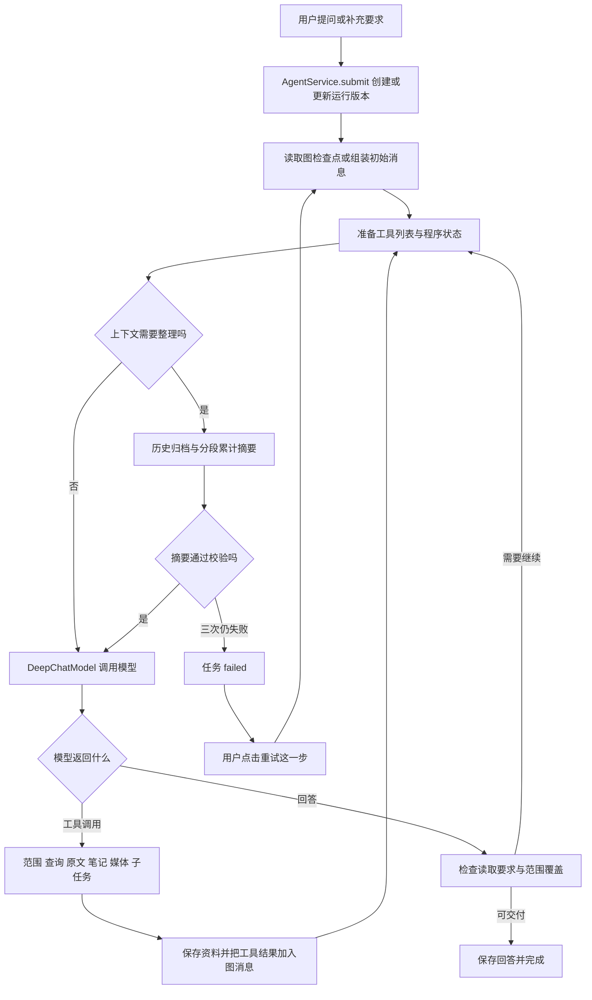

# AI 助手现行逻辑与重做依据

> 这是修复前的历史审计。后续已实施的改动和验证见 [上下文恢复修复记录](ai-context-recovery-2026-09-14.md)。

核查日期：2026-09-14。范围：桌面 AI 助手的提问、查询、模型循环、上下文压缩、状态保存、恢复和结果展示；不展开微信解密、语音识别、向量索引算法本身。

本文描述核查时的工作区源码，以及本次失败的持久化记录。工作区有其他未提交改动，不能把当前源码等同于某个发布版本。此次只整理文档，没有继续修改运行逻辑或重新调用真实模型。

## 1. 结论先行

**问题集中在上下文管理的职责与失败边界，而不只是模型没按字数要求输出。** 当前实现把一次业务分析中积累的用户要求、模型过程、工具参数、聊天原文、工具结果等一起压成一段累计摘要，并把“摘要通过固定字节校验”设为下一次主模型调用的前提。连续失败就终止整个任务。

本次搜索工具已经执行成功。重启后的缩写补丁也确实执行了，但依然撞上同一个业务终止条件。把失败称为“原文和检查点已保留”只说明数据还在，不能说明压缩过程能从失败分段继续，也不能说明用户能拿到已有分析成果。

需要拆开的概念有五个：**原文资料、任务状态、分析发现、模型上下文、最终回答**。现在它们已经分别有一些存储结构，但执行时仍过度依赖一条不断增长的模型消息历史，以及压缩这条历史的单段摘要。

## 2. 本次失败的确切记录

任务 ID：`8fbda9940a8f4587b3380a36262a4c10`。同一个任务重试，版本仍为 `1`。

| 项目 | 已核实的状态 | 含义 |
|---|---|---|
| 当前引擎 | DeepAgents，engine_version=3 | 使用当前主执行入口 |
| 查询方式 | search，complete_required=false | 普通问答，不是强制逐页提交的完整报告 |
| 时间范围 | 从 0 到原任务创建时的 cutoff | 全历史范围；重试不自动更新截止时间 |
| 原文库计数 | 2146 条 | 任务已保存的去重来源数 |
| 当前范围覆盖计数 | read=2000，analyzed=0 | 覆盖快照未随后续搜索刷新；直接查询该范围原文实际也是 2146 条 |
| 已读分页 | 12 页，committed_pages=12 | 普通读取页会自动推进，不表示提交了分析笔记 |
| 分析笔记 / findings | stage_note=0，finding=0 | 普通路径没有形成结构化分析发现 |
| 业务工具调用 | 20 次 | 重启后的这次重试没有新增业务工具调用 |
| 模型调用 | 23 增至 28 次 | 新增 5 次全部用于摘要 |
| 最终错误 | 摘要 13010 字节，上限 8192 字节，已尝试 3 次 | 程序主动拒绝摘要并结束任务 |

重启后的摘要调用，来自 `usage` 审计，而非猜测：

| 开始时间（本地） | 输入 Token | 输出 Token | 耗时 | 上游结束原因 |
|---|---:|---:|---:|---|
| 11:06:56 | 25075 | 3322 | 53.5 秒 | stop |
| 11:07:50 | 3443 | 2471 | 40.3 秒 | stop |
| 11:08:31 | 25186 | 5156 | 78.9 秒 | stop |
| 11:09:50 | 7748 | 4868 | 82.8 秒 | stop |
| 11:11:13 | 7459 | 4868 | 83.8 秒 | stop |

合计输入 **68911 Token**、输出 **20685 Token**，模型调用耗时约 **339.4 秒**。五次上游请求都正常结束；`usage.status=success` 不表示摘要通过业务校验。

结合源码调用顺序，记录对应：第一段生成过长 → 缩写通过 → 下一段生成过长 → 缩写两次仍不通过 → 失败。这里的“三次”指最后失败分段的尝试次数，不是整次压缩只请求了三次。

最新上下文圈显示约 **3.5%**，对应最后一个缩写请求的 21815 个保守预算单位，不代表主 Agent 的全部待压缩历史只占 3.5%。

数据库还保存着之前成功提交的压缩事件（cutoff_index=15）和一个约 1.23 MB 的历史归档文件。这证明资料及早先检查点存在，**不能证明本轮分段压缩进度已保存**。

审计没有保存这五次调用的完整摘要正文、每次字节数及显式分段编号，因此不能逐字比较两次 4868 Token 的输出，也不能把 Token 数直接换算成字节数。本文不作这些推断。

结构化证据及源码指纹见 [核查快照](D:/workProject/WeChatDataAnalysis/docs/ai-agent-compaction-evidence-2026-09-14.json)。不包含 API 密钥或聊天正文。

## 3. 现在的主链路



该图表示逻辑关系，不是完整的框架中间件嵌套顺序。还有单独的上游超限回退、文件外置和模型协议重试，见后文。

生产入口是 [AgentService](D:/workProject/WeChatDataAnalysis/src/wechat_decrypt_tool/ai/agent_service.py:33)，继承 `DeepAgentRuntime + DeepProjection + AgentTimeline`。它没有继承旧的自定义 Agent 主循环。

## 4. 提问、补充、继续与重新运行

| 操作 | 现行行为 | 后续重做要注意 |
|---|---|---|
| 新提问 | 保存用户消息、创建 run，快照化模型配置和 cutoff，后台启动图 | 同一 request_id 幂等；不是每次点击都创建独立运行 |
| 运行中补充要求 | 同一 run 的 version 加一，取消旧 worker；清空当前回答、范围等，合并 input_digest | 新版本使用新图检查点，避免沿用旧筛选条件下的工具消息 |
| 已结束后追问 | 创建新 run，记录 previous_run_id | 历史回答、少量已验证发现和内部笔记可进入新轮 |
| 重试这一步 / 继续查找 | `/continue` → resume，同一 run、version、图检查点重新执行 | 不是精确重试最后一个 UI 工具；也不是压缩分段断点续传 |
| 重新运行历史问题 | restart → submit，创建新 run，继承问题、模型选择和相关查询条件 | 与 resume 不同；旧引擎任务需要走这条路径 |
| 停止 | 标记取消，取消 worker | 原文和已提交资料保留 |
| 应用启动恢复 | 把仍为 queued/running 的遗留运行转为可恢复的中断状态 | 启动应用本身不等于自动重跑全部任务 |

`execute()` 通过检查点的待执行节点决定传入新消息还是以 `inputs=None` 恢复。补充要求走新版本；普通重试维持旧版本。因此业务状态、原文和图检查点之间的版本对应关系是重做时必须保留的约束。

入口：[deep_runtime.py](D:/workProject/WeChatDataAnalysis/src/wechat_decrypt_tool/ai/deep_runtime.py:355)、[HTTP 路由](D:/workProject/WeChatDataAnalysis/src/wechat_decrypt_tool/routers/ai_agent.py)、[前端按钮](D:/workProject/WeChatDataAnalysis/frontend/components/chat/ChatAgentPanel.vue:309)。

## 5. 范围和业务工具

### 5.1 范围如何决定

模型先调用 `select_chat_scope`。程序校验账号、联系人、时间、发言人、最近消息条数等，保存范围句柄。当前聊天由前端传入；无时间要求时允许全历史。系统提示要求模糊“最近”默认近七天并说明，但这仍有模型理解和工具参数选择参与。

`complete=true` 或正则识别到“完整报告、全面分析、全部提取”等明确要求时，进入强制完整覆盖路径。普通“有哪些事还没确认”没有被自动视为完整报告。本次实际选的是全历史普通搜索范围。

现有范围结构包括：会话列表、start/end、sender、message_count、complete_required、mode、cursor、conversation_index、pending_page、pages、committed_pages、warnings。

### 5.2 工具职责表

| 工具 | 实际职责 | 是否形成已分析覆盖 |
|---|---|---|
| select_chat_scope | 解析并保存范围，返回真实 scope_handle；触发后台索引准备 | 否 |
| search_messages | 每次查一个会话的索引搜索；底层请求 hybrid，每页 50 条；保存命中原文 | 否；命中不等于完整覆盖 |
| search_live_messages | 根据索引末尾时间确定实时缺口，逐页读取后做关键词匹配 | 否；扫描和命中不同 |
| read_messages | 按时间和容量读取下一页；每页容量最大 48 KiB，或输入预算的三分之一 | 普通页自动推进；完整分析页必须先提交 |
| commit_findings | 对当前 pending_page 提交事实和来源；空列表也可提交；落库 stage_note | 是，以来源的完整字符区间覆盖统计 |
| read_context | 读取已知来源前后文并限制在当前范围；定位失败时可返回已保存原文及缺口 | 否 |
| count_messages | 程序遍历并统计，不由模型估算数量 | 只完成统计，不代表内容分析完成 |
| read_results | 分页读取本轮已保存 finding，每页 20 项 | 读取已有结果 |
| search_material | 回查本轮或同一 AI 对话旧轮的已保存原文 | 否；返回来源重新登记 |
| read_material | 按字符位置续读长消息，每次最多 4000 字符 | 否 |
| analyze_media | 根据本轮模型能力解释图片或提取附件文字；独立保存派生结果 | 不等于范围全文分析 |
| task | 创建隔离的范围分析 / 事实核查子任务，合并其原文和发现 | 范围分析成功后可完成对应范围 |
| ls / grep / read_file | 查询任务虚拟文件，包括历史、笔记和资料 | 否 |
| write_file / edit_file | 模型只可写任务内部 notes/plans/drafts | 写普通笔记不自动计为 stage_note 覆盖 |
| write_todos | 框架内任务计划 | 不是证据或分页提交 |

实时搜索底层每页最多 200 条、批次字节上限 1 MiB；网关单次最多循环 8 页，找到命中或耗时超过约 1 秒即返回。这与普通读取的 48 KiB 容量不是同一个限制。工具输出后还可能被框架外置。

### 5.3 已有防循环机制及其局限

`RuntimeEvents` 会按真实状态动态隐藏工具：没选范围时主要允许选范围；完整分析待完成时限制搜索；有 pending_page 时优先提交；连续三次搜索无新增且无下一页时引导读取。

同一参数、同一结果、同一进度重复两次会加提示，四次会失败。进度增加会重置这项计数。因此**“不断拿到少量新资料、但迟迟不收尾”的搜索扩张不一定被拦住**。主图递归上限为 100000，也没有普通问答的固定总调用额度作为实际收尾机制。

这解释了为什么普通问题仍可能读取数千条历史。源码中的“证据足够即答”主要是提示约束，尚不是明确的、可观察的停止策略。

来源：[工具与范围](D:/workProject/WeChatDataAnalysis/src/wechat_decrypt_tool/ai/deep_tools.py)、[底层读取与搜索](D:/workProject/WeChatDataAnalysis/src/wechat_decrypt_tool/ai/agent_tools.py)、[运行约束](D:/workProject/WeChatDataAnalysis/src/wechat_decrypt_tool/ai/deep_runtime.py:76)。

## 6. 原文已落库，为什么上下文还会变大

`save_messages()` 同时做两件事：把完整原文按来源去重保存，以及生成给模型看的工具 payload。payload 包含文字、时间、发言人、来源编号、内部路径和可选引用 / 续读字段。

**数据库去重不等于模型历史去重。** 新的搜索、前后文回查、分页结果仍会作为 ToolMessage 加入图。已保存原文再次返回时，模型历史里仍可能多一份相同或重叠内容。当前没有一个统一的“只向模型追加尚未见过的最小证据包”的构建器。

模型当前请求可能同时包含：

1. 系统提示、业务规则，以及本轮可用工具 Schema。
2. 用户要求和上一轮的近期消息。
3. 程序注入的真实范围、待提交页、来源样例等恢复状态。
4. 模型的过程文字、工具调用及工具返回。
5. 先前压缩得到的摘要和归档路径。
6. 正文续写、覆盖未完成、工具参数错误等自动反馈。

新一轮初始历史按 `B/4` 字节容量从近到远选取；更旧内容完整写入 `/history/previous.json`。上一轮最多取 20 条已验证 finding，及最多 20 份符合约束的内部笔记作为可回查历史。这条历史继承路径与运行中压缩是两套处理。

## 7. 预算不是一套统一口径

设 `W` 为模型配置窗口，`O` 为程序按模型元数据计算的输出预留，`B=input_limit(profile)`。

| 位置 | 现行计算 | 关键差异 |
|---|---|---|
| 模型输入容量 B | 配置预算、W−O−512、上游 input 上限中的约束值 | 元数据以 Token 窗口描述 |
| request_size / context_tokens | UTF-8 字节、消息封装、工具 Schema 等保守估计；图片有独立估值 | 返回值不是供应商实际 Token |
| 主请求检查 | ContextMeter 可用历史真实 usage 校准相同请求前缀 | 与纯字节估计不同 |
| 自动压缩触发 | `max(1024, floor(B×0.8))`，使用 context_tokens；框架也可参考匹配供应商的 reported usage | 不调用 ContextMeter 的校准结果来决定触发 |
| 压缩保留尾部 | `max(256, floor(B×0.1))` | 按 token_counter 切分且维护工具调用配对，不是保留最近固定轮数 |
| 摘要输入预算 S | `min(65536, max(512, floor(B×0.55)))` | 65536 是本次补丁加入的请求保守上限 |
| 单段累计摘要目标 T | `min(8192, max(128, floor(S/5)))` | 严格 UTF-8 字节上限，不随资料复杂度增长 |
| 主模型 / 摘要实际输出参数 | 一般 `max_tokens=min(output_limit,8192)` | 8192 Token 与摘要 8192 字节不是一个东西 |
| 超大工具结果外置 | 参数 `max(512,min(24000,B/8))`，框架内部另用字符近似等策略 | 不是统一的 UTF-8 请求计量 |
| 前端上下文圈 | 最近一次 publish_context 的 used / B | 摘要调用也更新它，会把主 Agent 的显示覆盖成摘要请求占用 |

本次配置数值：W=1000000，O=384000，B=615488，压缩触发约 492390，保留尾部约 61548，S=65536，T=8192。这里的 W/O 是**本地配置快照**，本文没有核实供应商真实能力。

另一个不一致是：输入预算预留了 384000 的输出空间，但普通实际请求最多只发 8192 的输出参数。这不证明压缩一定触发过早，但说明容量计算和实际请求参数没有统一。

因此，“界面才 3.5% / 22.8%，为什么在压缩”不能只用圈上的数字回答。它可能显示的是另一个内部请求，且触发计量与显示计量不同。现有审计也没有逐次记录压缩是因估计阈值、框架回退还是上游超限触发，不能事后凭圈值断言。

来源：[预算计算](D:/workProject/WeChatDataAnalysis/src/wechat_decrypt_tool/ai/agent_budget.py)、[计量校准](D:/workProject/WeChatDataAnalysis/src/wechat_decrypt_tool/ai/context_meter.py)、[图配置](D:/workProject/WeChatDataAnalysis/src/wechat_decrypt_tool/ai/deep_runtime.py:477)、[模型请求](D:/workProject/WeChatDataAnalysis/src/wechat_decrypt_tool/ai/deep_model.py)。

## 8. 压缩算法逐步拆解

### 8.1 框架外层

使用 DeepAgents 0.7.13 的 SummarizationMiddleware，并由 `DurableSummarization` 覆写关键步骤。同名替换用于避免注册两个摘要调度器。

1. 根据之前已提交的 `_summarization_event` 组装有效历史。
2. 把系统说明、当前工具定义和消息计入触发估计；框架还可能先处理超大的旧工具参数。
3. 未达触发条件时先调用主模型；若发生 ContextOverflowError，框架也会回退到摘要。
4. 找切分点，保留近期尾部。应用额外处理单条超长用户输入和已配对的大工具批次。
5. 处理媒体外置，然后**并发**进行历史归档和 `_acreate_summary()`。
6. 摘要成功后，用“累计摘要 + 历史文件路径 + 保留尾部”调用主模型。
7. 主模型调用返回后，把新的摘要事件随 Command 提交到图状态。

注意：当前异步实现是归档与摘要并发，不是“归档成功后才开始花费模型调用”。应用会验证归档，阻止未归档时继续主模型，但摘要调用可能已经开始。主模型在压缩完成后若又失败，本轮新摘要事件也未必提交。

### 8.2 应用的分段累计摘要

输入并非纯聊天文字，而是 `message_to_dict()` 后序列化的完整消息结构。角色、工具调用参数、结果及消息附加字段都会进入历史字符串。

```text
previous = 空字符串
offset = 0
S = 本次摘要请求预算
T = 单段累计摘要字节上限

while 还有未处理历史:
    扣掉提示词、previous、请求封装，计算本段 available
    按 UTF-8 边界取 fragment
    draft = 空字符串

    最多尝试 3 次:
        有完整超长 draft → 请求缩写 draft，并带 previous
        否则 → 请求合并 previous 与 fragment

        上游上下文超限 → S 减半、缩小 T，重新处理当前位置
        合法且字节数 <= T → 更新 previous，推进 offset
        完整但过长且修复请求放得下 → 下次缩写 draft
        空、占位文本、被截断或 draft 太大 → 缩小原文 fragment 再试

    三次均不通过 → 抛 ProviderFailure，整轮摘要失败

return previous
```

合法性检查只涵盖非空、非已知失败占位、未标记输出截断、字节数达标。**没有检查关键待办、来源或分页位置是否在连续压缩中被遗漏。** 提示词要求保留这些信息，不等于程序保证保留。

当前的缩写修复只在提示词里报告实际字节数、给更小的汉字建议；并没有一个能保证收敛的长度控制器。被模型正常结束但仍有 13010 字节的结果会再次被拒绝。直接截断字符串虽能凑够字节数，却可能切掉待办、来源和否定条件，也不应作为默认答案。

### 8.3 有三层不同重试

| 层级 | 行为 | 是否保存该层进度 |
|---|---|---|
| DeepChatModel | 最多 3 次网络 / 协议尝试；单次 240 秒，总期限 600 秒；已暴露输出后限制重试 | 保存调用审计；不是业务检查点 |
| 单段摘要 | 最多 3 次生成 / 缩写 | previous、offset、draft、attempt 都是函数局部变量 |
| 主请求超限恢复 | 框架自动回退之外，应用默认还允许 2 次超限恢复，缩小保留量和摘要预算 | 只在图成功提交时保留最终事件 |

所以“尝试 3 次”不是全任务模型调用上限，也不是压缩工作的总耗时上限。一次大历史分多段，再叠加每段修复，调用数会继续增加。

### 8.4 压缩失败为什么阻断业务

`ProviderFailure` 从摘要函数冒泡到 `DeepAgentRuntime.execute()` 的通用异常分支，写入 `status=failed`，错误类别统一为 deepagents / execution。

这里没有压缩专用的可恢复状态，没有把“模型仍能接受的较长摘要”作为动态候选，也没有改用已存结构化成果构造下一轮上下文的路径。**固定 8192 字节目标被当成硬性业务完成门槛。**

这一段对应 [deep_context.py](D:/workProject/WeChatDataAnalysis/src/wechat_decrypt_tool/ai/deep_context.py:100) 和 [失败出口](D:/workProject/WeChatDataAnalysis/src/wechat_decrypt_tool/ai/deep_runtime.py:662)。

## 9. 已经持久化什么，没持久化什么

| 存储 | 内容 | 故障后的实际价值 |
|---|---|---|
| ai.sqlite3 / records | agent_thread、agent_run、模型配置、usage 审计等 | 能找到任务、状态、问题、费用和时间线 |
| agent_material | 去重原文来源，按 run 保存 | 可回查原文；不等于模型自动知道怎样继续 |
| agent_piece / deep_scope、deep_page、read_cursor | 范围、页、游标、pending 状态 | 支持读取与提交的幂等恢复 |
| agent_piece / finding、stage_note | 事实、来源与已分析字符覆盖 | 支持明确的内容分析进度；本次没有生成 |
| agent_piece / deep_file | 虚拟文件：历史归档、笔记、计划、子任务结果等 | 路径指向 SQLite 内容，不是宿主磁盘文件 |
| agent_subtask | 子任务状态及父子关联 | 子任务结果查询、合并和版本校验 |
| deepagents_checkpoints.sqlite3 | LangGraph 状态、写入、已提交摘要事件 | 恢复图节点，不能恢复某个 Python 函数内部的局部变量 |
| 仅存在内存 | 当前摘要分段 offset、累计摘要 previous、候选 draft、尝试次数 | 本轮摘要失败后不能直接从这些位置继续 |

特别要区分：分页的 `pending_page` 有数据库记录，摘要的“第几段做到哪”没有类似记录。二者虽然都叫恢复，能力并不相同。

历史归档与检查点不是同一个事务；框架会追加归档。失败后再次整理相同未提交历史存在重复追加的路径，需在重做时验证并使其幂等。当前 1.23 MB 的归档大小本身不证明其中每段都是重复内容。

## 10. 分析计数、最终回答与前端状态

“已读取”主计数取原文库去重数量。“已分析”取 stage_note 连续覆盖完整原文字符区间的数量。普通问答页无需 commit_findings，读完只增加 committed_pages，因此会出现已经读了很多、模型也写了过程文字，但 analyzed 仍为 0。

这是统计字段含义与普通问答 UI 文案不匹配。**不能通过让 read_count 直接等于 analyzed 来修饰这个数字**，否则会把阅读、处理、结构化提交混为一谈。

另有一个独立的刷新问题：`save_messages()` 更新总 read_count，搜索路径没有同时调用 coverage()；read_next / commit 等路径才刷新覆盖记录。本次数据库中当前范围原文实际为 2146 条，持久化 analysis.coverage.read 却停在 2000 条。因此界面的两种读取进度还可能是不同时间的快照，不能仅解释成筛选范围不同。

当前回答流程：

- 工具调用附带的文字保存为 progress；确认是工具轮后清空临时 answer。
- 主模型正文流按约 80ms 节奏更新 answer 和时间线。
- 摘要及其他内部模型流被过滤，不进入对话正文。
- aafter_model 检查是否实际读取过资料、完整范围是否完成，必要时再请求模型继续；正文被截断可最多续写 8 次。
- execute 收尾时再次检查范围与数据源缺口，普通问答可给带缺口说明的阶段答案；强制完整范围未完成则中断。
- **当前工作区收尾代码已经直接交付正文，不再调用 validate_deep_answer 进行额外引用修复 / 证据复核 / 遗漏核查。** 函数仍保留，不能据函数存在就认为它正在执行。

压缩没有独立的时间线阶段：用户看到最后一个搜索工具成功，然后长时间等待，最终看到红色错误。与此同时，模型调用次数和 Token 审计仍增长。当前 `usage.status=success` 与“摘要是否通过”也没有分开呈现。

“重试这一步”的真实粒度是恢复最新任务的图节点，不是用户看到的最后一条工具记录，更不是保存了中间草稿的精确摘要重试。

## 11. 子任务与其他周边约束

主任务可委派 `range-analyst` / `fact-checker`。子任务绑定父任务授权范围和版本，不能任意扩展；不递归委派。程序按会话拆分，在 start 非零且跨度超过 60 天时还按 30 天分段。每批最多同时处理 4 个分片。

子任务有独立 run、线程、图检查点和原文；完成后合并原文、finding、stage_note，主模型收到结果路径及有限长度概述。未完成子任务可能使父工具失败，已经保存的子结果保留。它们也使用同一套上下文压缩，因此压缩缺陷并不限于主任务。

全应用模型调度默认并发 4，主任务优先、同优先级父任务轮转；429 会降低并发并逐步恢复。摘要复用当前模型路线，以 purpose=summary 审计，使用辅助调用策略；没有独立选择一个压缩模型。

媒体失败已有局部降级：图片不支持或解析失败时，可继续利用文字。**压缩失败还没有类似的局部降级边界。**

## 12. 旧逻辑与现行逻辑必须分开

| 文件 / 机制 | 当前地位 |
|---|---|
| deep_runtime / deep_context / deep_model / deep_tools | 新任务的主执行链 |
| deep_projection | 现行类继承，用于资料投影、预算展示和读取复用 |
| agent_tools / agent_reading / agent_workspace / agent_timeline | 仍被当前路径使用的基础能力 |
| agent_context / agent_continuous / agent_history 等旧混入式主循环 | 文件仍在，但 AgentService 没有继承这些旧执行器；不能作为当前压缩流程依据 |
| compaction_policy.py | 配置模型仍存在；当前 ContextMeter 使用 usage_calibration，其大部分压缩参数未接入 DurableSummarization |
| history_summary_bytes / summary_attempts / pressure_ratio 等配置 | 不能据配置字段存在就认为改它会改变当前 v3 的 8192 / 3 次 / 0.8 行为 |
| validate_deep_answer 及相关修复函数 | 定义仍在，但当前 execute 正常收尾未调用；部分底层校验工具仍可被其他路径使用 |
| docs 中早期验收与压缩说明 | 历史记录，不是当前运行事实的权威来源 |

重做前应先画出实际调用关系，再决定保留 / 删除 / 迁移。不能只改同名配置文件后宣称生效。

## 13. 设计问题清单

| 编号 | 问题 | 直接后果 | 后续边界要求 |
|---|---|---|---|
| P1 | 摘要硬字节目标成为业务成功条件 | 多个搜索成功后，最后无答案 | 压缩故障与分析任务状态分开 |
| P2 | 阅读、搜索结果持续进入会话历史 | 资料越找越多，重复原文和元数据一起压缩 | 模型输入由受控证据包构建，不等于全部工具日志 |
| P3 | 全部语义依赖一段反复改写的累计摘要 | 任务要求、状态、证据和叙述竞争 8192 字节；语义损失不可见 | 硬状态由程序持有，摘要只承担可丢弃的软记忆 |
| P4 | 分段压缩无独立检查点 | 重试重复成本，已经成功的内部工作不能接续 | 压缩作业保存输入指纹、分段进度、候选和版本 |
| P5 | Token、字节、近似字符和校准估计混用 | 触发、展示、请求容量无法直接对齐 | 每个量标单位，统一预算服务和调用目的 |
| P6 | 摘要也覆盖主上下文圈 | 小百分比与压缩失败同时出现 | 主任务压力与内部请求用量分开展示 |
| P7 | 普通问答缺少可靠收尾策略 | 全历史扩大检索，大量工具成功但没有持久成果 | 明确证据充分、无新增、时间范围和阶段输出策略 |
| P8 | 普通问答不产出可恢复的结构化发现 | analyzed=0，恢复主要依赖图历史 | 普通问答也要有轻量成果，且不冒充全量覆盖 |
| P9 | 压缩不可见且审计 success 含义过宽 | 不知道在等什么，也不能定位哪个分段失败 | 压缩阶段、分段、原因、用量、验证结果可观察 |
| P10 | 旧配置和旧函数继续存在 | 改错位置、测试覆盖了非生产路径 | 明确单一执行入口及配置接线 |
| P11 | 语义保留只靠提示，没有验证 | 字节合格的摘要仍可能漏掉重要条件 | 验证必要状态与证据引用，允许回查原文 |
| P12 | 模型响应正常 ≠ 摘要适用 | 现有 API 成功审计掩盖业务失败 | 分开 transport、generation、validation、commit 状态 |
| P13 | 原文总数和覆盖快照刷新入口不同 | 同一范围出现 2146 / 2000 的过期统计 | 状态投影来自一致快照，或明确各计数的更新时间 |

本次补丁修复了“总是重读完整原文”中的一部分，增加了缩写和分段上限，但没有解决 P1、P3、P4、P5、P6、P8、P9。这就是它通过模拟回归后，真实长任务依然失败的原因所在。测试证明了分支、预算和不跳过原文等性质；不能证明真实模型三次以内一定输出合格且语义完整的摘要。

## 14. 后续重做的决策与验收依据（尚未实施）

建议先确定数据和执行边界，再决定继续使用 DeepAgents 还是更换框架。当前缺陷有相当一部分来自应用自己定义的预算、摘要要求、异常出口和展示投影，单换框架并不自动解决。

### 14.1 应先确定的设计

1. **任务状态独立保存**：用户当前要求、真实范围、游标、待提交页、截止时间、已完成目标都由程序维护，不要求模型从压缩摘要重建。
2. **资料与上下文解耦**：原文留在可寻址资料库；给模型的是当前步骤所需的有界证据，去重、可续读、可回查。
3. **业务成果独立于会话记忆**：普通问答和完整报告都能形成带来源的阶段成果，但完整覆盖另有明确标志。
4. **摘要成为可恢复的内部作业**：单独记录输入、分段、成功候选、失败原因与版本；可重试、可替代，不与业务终止绑定。
5. **统一容量决策**：结合实际发送的输出参数和模型计量；明确软目标、硬窗口、保守估计。较长摘要是否可用应由剩余容量和信息要求决定，而不是只有一个全局 8192 字节门槛。
6. **让失败有不同后果**：来源暂不可用、工具参数错误、压缩失败、网络失败、覆盖未完成分别定义恢复方式；不能全部归为 deepagents execution failed。
7. **显示真实进度**：正在检索、正在提炼成果、正在整理上下文、等待模型、可交付阶段结果分开；“重试”文案与实际恢复粒度一致。

这些是重做约束，不是本次已经完成的实现。具体摘要算法、模型选择、容量比例和 UI 交互需要在新方案中确定。

### 14.2 可以保留的基础

原文来源编号和只读约束、scope_handle 权限校验、读取游标、pending_page 提交机制、去重原文库、阶段笔记覆盖、按版本隔离、模型调用审计、媒体局部降级和来源回查都有独立价值。应先保住这些数据合同，再拆主循环和压缩逻辑。

### 14.3 必须通过的真实验收场景

- 本次 2146 条资料场景：压缩故障不应让所有已形成的业务成果不可交付；有明确的暂停 / 降级路径。
- 摘要返回 13010 字节、含大量中文、来源 ID、长路径：系统能按明确策略处理，且不靠盲目三次重试碰运气。
- 在第 N 段压缩失败或应用退出：恢复时不重做已持久化成功的 N−1 段，并校验源输入没有变化。
- 缩写结果变短但漏掉未完成事项或改变否定条件：不得仅因字节合格就认定满足记忆合同。
- 同一来源被搜索和前后文回查多次：原文存储去重，模型证据输入也有明确去重行为。
- 普通问答与完整报告分别测试：前者可证据足够就答，后者不能把搜索命中或阅读页数冒充完整分析。
- 不同模型窗口、不同真实 Token 密度、不同输出参数：压力显示与触发可解释，摘要请求不覆盖主请求压力。
- 自动压缩的失败、修复和恢复均能在时间线与审计中定位到同一个作业 / 分段。
- 补充要求改变会话或时间后，旧摘要与旧成果不会绕过新版本的范围校验。
- 子任务压缩失败时，已完成兄弟任务成果可用，父任务具有明确处置路径。
- 重启后验证实际进程加载版本，并使用真实故障材料进行受控复现；模拟模型测试不能代替这一步。

## 15. 建议阅读顺序

1. [deep_runtime.py](D:/workProject/WeChatDataAnalysis/src/wechat_decrypt_tool/ai/deep_runtime.py)：主入口、恢复、图构建、事件和失败出口。
2. [deep_tools.py](D:/workProject/WeChatDataAnalysis/src/wechat_decrypt_tool/ai/deep_tools.py)：范围、原文登记、分页提交和工具合同。
3. [deep_context.py](D:/workProject/WeChatDataAnalysis/src/wechat_decrypt_tool/ai/deep_context.py)：现行压缩及失败条件。
4. [agent_budget.py](D:/workProject/WeChatDataAnalysis/src/wechat_decrypt_tool/ai/agent_budget.py)、[context_meter.py](D:/workProject/WeChatDataAnalysis/src/wechat_decrypt_tool/ai/context_meter.py)、[deep_model.py](D:/workProject/WeChatDataAnalysis/src/wechat_decrypt_tool/ai/deep_model.py)：预算、计量与上游调用。
5. [agent_workspace.py](D:/workProject/WeChatDataAnalysis/src/wechat_decrypt_tool/ai/agent_workspace.py)、[deep_backend.py](D:/workProject/WeChatDataAnalysis/src/wechat_decrypt_tool/ai/deep_backend.py)、[deep_checkpoints.py](D:/workProject/WeChatDataAnalysis/src/wechat_decrypt_tool/ai/deep_checkpoints.py)：三类保存和恢复边界。
6. [AgentRun.vue](D:/workProject/WeChatDataAnalysis/frontend/components/chat/AgentRun.vue)、[ChatAgentPanel.vue](D:/workProject/WeChatDataAnalysis/frontend/components/chat/ChatAgentPanel.vue)：界面状态与操作粒度。
7. [test_ai_deep_context.py](D:/workProject/WeChatDataAnalysis/tests/test_ai_deep_context.py)：现有模拟回归保证了什么；结合本次审计判断缺失的真实验收。
