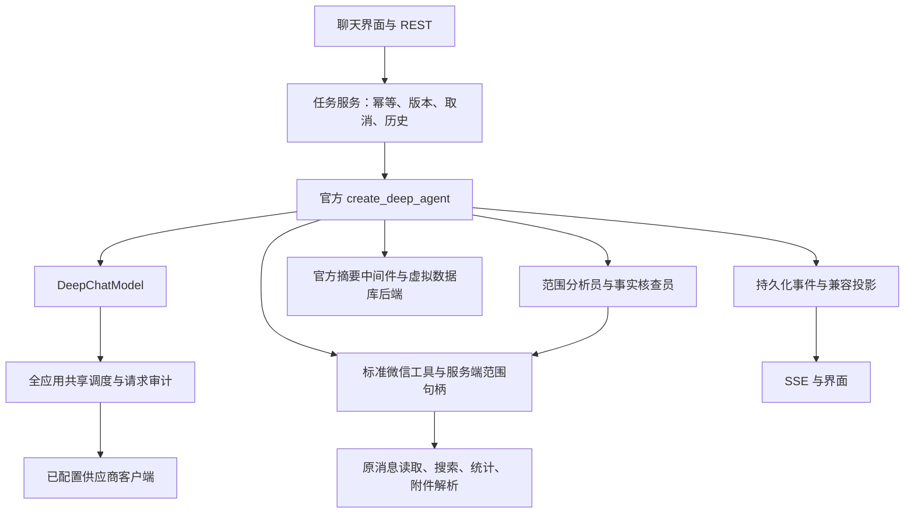

# 微信助手 DeepAgents v3

本说明取代旧版三阶段执行流程。依赖固定为 `deepagents==0.7.13`，由 `uv.lock` 锁定传递依赖。验收记录见 [迁移验收](deepagents-acceptance.md)。

## 执行路径

`AgentService` 保留 HTTP 层所需的任务生命周期，生产运行继承 `DeepAgentRuntime`，不再运行旧的 `parse_context → 决策 → answer` 循环。旧报告主循环和旧子任务执行器不再进入生产调用链。复用的分页、日期、原文、统计和来源函数仍是独立数据能力。

问候和能力询问在同一次主模型请求直接生成正文，没有模型路由器或问候白名单。初始工具只提供范围选择和内部笔记写入；有内部资料后提供回查工具，已有笔记可直接修改，不必先查询聊天。已选范围后再提供查询、统计、分析等工具。模型可以直接回答，不强制调用工具。

消息提交只校验账号归属、读取本地模型配置、落库并启动任务。会话目录、人物目录和索引在查询工具真正执行时才使用。模型能力通过本地缓存读取，远程目录刷新不阻塞提交。完整会话 ID 列表只保存在服务端状态中，模型收到数量、有限候选名和范围句柄。

## 模块职责

| 模块 | 职责 |
| --- | --- |
| `deep_runtime.py` | 官方图构建、公开中间件、子图委派、版本与恢复、正文投影和最终校验 |
| `deep_model.py` | 原生工具与 JSON 协议适配，模型请求调度、计量、超时和兼容缓存 |
| `reasoning_client.py` | 官方 SDK 的扩展字段透传，保留 MiMo 原生多轮工具消息所需的 `reasoning_content` |
| `deep_tools.py` | 查询范围、读取游标、已提交页面、检索、精确统计和原文回查 |
| `deep_backend.py` | 账号、运行、输入版本隔离的数据库虚拟文件后端 |
| `deep_context.py` | 官方摘要的触发、历史持久化核验和失败保留 |
| `deep_validation.py` | 日期、文件声明、来源归属及完整报告的独立证据核验 |
| `deep_projection.py` / `deep_subtasks.py` | 现有答案、来源、资料分页和子任务字段的兼容投影 |

## 数据范围与完整性

- `account`、运行 ID 和输入版本由服务端注入。工具参数没有可用于改变账号的字段。
- `scope_handle` 绑定当前运行与版本；过期、跨运行或跨账号的句柄不能读取资料。
- 使用固定截止时间、固定时区与左闭右开区间。用户明确写出的时刻优先于模型的换算值。最近 N 条是用户明确指定的总量，不是分页大小。
- 查询时匹配明确点名的会话，防止参数失败后扩大到全部聊天。重名返回澄清候选。完整读取不能只覆盖点名对象中的一部分。
- 普通搜索保存实际命中和来源，实时缺口使用独立游标回查，不把搜索完成当成分析完成。
- 完整范围的每一页先保存原文，再提交带来源的发现和覆盖区间；即使无相关发现也必须提交。失败重放返回尚未提交的同一页。
- 来源按真实消息身份去重。同秒消息依靠稳定游标和消息身份，长消息的字符偏移随页面保存。覆盖显示按会话合并，避免重复范围造成数量翻倍。
- 精确统计由程序计算；日分布和发言人分布分页读取计算结果。读取存在缺口或警告时不能宣称完整。

范围分析员和事实核查员由官方 `task` 子图入口执行。服务端将范围绑定到子运行，范围分析员不能缩小或扩大分配范围，不能更换受限发言人；子任务不能递归委派。超过 60 天的范围按 30 天分片。已完成的子任务按确定性身份复用，父任务汇总时不重复计算用量或原文。

## 模型与上下文

原生模式使用自动工具选择，正文可流式输出。非原生模式只接受工具列表或包含完整正文的最终回答 JSON；适配器转换为标准 `AIMessage` 后继续由 DeepAgents 执行。JSON 正文校验完成后再展示，不额外请求一次正文。明确拒绝工具参数时才切换兼容模式，缓存按接口、模型和配置版本隔离。已确认支持 JSON mode 的接口启用该格式约束，仍进行本地结构检查。

参数纠正、兼容重试、附件解析、摘要、子任务和证据核查均进入同一调度和审计。全应用模型并发上限为四，前台请求优先，遇到限流退让。排队取消或本地适配初始化失败不记成已经发出的模型请求；上游未返回用量的请求明确记录未知。

MiMo 的扩展字段通过官方 OpenAI SDK 完整透传，不把思考字段显示在正文。已确认的供应商输出上限用于预算；显式模型配置和思考等级仍优先。参考 [MiMo 多轮工具调用要求](https://mimo.mi.com/docs/en-US/quick-start/usage-guide/text-generation/deep-thinking)、[模型长度上限](https://mimo.mi.com/docs/en-US/quick-start/summary/model)及 [JSON mode](https://mimo.mi.com/docs/en-US/quick-start/usage-guide/text-generation/structured-output)。

上下文由官方摘要中间件触发，`DurableSummarization` 负责持久化核验、分段摘要和超限恢复。默认阈值为可用输入预算的 80%，目标保留约 10% 的近期消息，正常摘要请求上限为 55%。这里的预算采用 UTF-8 字节保守估算，计入工具定义、工具参数和需要回传的思考字段，不等于供应商实际 Token 用量；主请求的用量校准不改变此摘要计数口径。

待压缩历史按时间顺序全部进入分段摘要，不再使用要求从用户消息开始的尾部裁剪。单条超长消息也按 Unicode 字符边界分段。每一段的完整请求计入提示词、累计摘要和消息封装；模型合并上一段摘要与本段资料，生成新的累计摘要。摘要目标上限为本次摘要请求预算的 20%，最多 8192 UTF-8 字节；空摘要、过长摘要及框架占位内容最多尝试三次，失败保留原检查点。这是语义摘要，不保证逐字保留，完整原文仍通过归档路径回查。

未到阈值但本地检查或供应商报告上下文超限时，框架立即压缩后重试。主动压缩后主请求仍超限，则额外恢复最多两次，每次将近期保留量及摘要请求预算缩小一半（摘要请求预算最低 1024）。摘要请求自身超限时缩小片段，未成功的片段不推进游标；固定提示内容也放不下时停止，避免无限重试。同时超过近期保留量与摘要请求预算的已完成工具批次可整组归档摘要，保持工具调用与结果配对。历史归档在压缩后的主模型调用之前核验；归档或摘要失败不提交压缩结果。整个流程继续使用同一模型调度和用量审计，摘要正文不进入公开回答。

虚拟文件后端不连接宿主文件系统。模型只能修改 `/notes/`、`/plans/`、`/drafts/`；原文和应用说明只读。框架产生的历史与大结果由服务端存入内部区域。资料与子任务中的指令不能改变这些边界，没有终端、联网搜索或发送微信的工具。

同一 AI 对话的新轮次桥接近期对话、可回查来源和内部笔记。带引用笔记先核验编号和归属；笔记仍不是原始证据，也不是新用户指令。其他 AI 对话不继承这些资料。

## 完成、停止与恢复

新任务写入 `engine=deepagents`、`engine_version=3`。检查点位于独立的 `deepagents_checkpoints.sqlite3`，新运行的命名空间包含账号、AI 对话、运行和输入版本。早期隔离验收的 v3 命名空间保留兼容读取，不与旧引擎检查点混用。

停止保留原文、待提交页面、发现和子任务成果。恢复使用新检查点；如果图已保存最终回答但应用尚未提交完成状态，直接交付已保存的正文。旧版本已保存的草稿仍优先恢复，不被图中早先的正文覆盖。运行中补充要求先增加版本并取消旧工作，再以新版本继续；过期结果不可提交。

正文生成后直接保存回答并结束任务，不再执行独立的引用核查、证据复核、遗漏核查或自动修正，也不为这些步骤追加模型调用。普通问答、完整报告和子任务均使用这一完成流程。

读取范围、分页提交和数据源缺口仍按工具返回的程序状态记录；完整范围尚未处理完时保留阶段结果。回答后的核查不再作为完成状态的前置条件。

## 历史迁移与接口

首次启动切换前通过 SQLite backup API 写入 `before-deepagents-v3.sqlite3`，再记录迁移标记。旧答案、来源、用量和原始任务状态保留可读。旧未完成任务不能继续执行旧检查点，也不会自动产生模型费用。

保留 `/api/ai/agent` 现有对话、消息、运行、资料和 SSE 接口。新增：

- 运行字段：`engine`、`engine_version`、`can_resume`、`restart_required`、`restarted_from`。
- 覆盖状态：`not_applicable`、`partial`、`complete`、`unknown`。
- `POST /runs/{id}/restart`：请求体带 `request_id`，幂等创建新引擎运行，并关联旧运行。
- 对旧引擎运行调用 `continue` 返回明确的迁移错误和重新运行入口。

删除 AI 对话或清理账号时，同时清理原文、内部文件、子任务关联和新检查点。生产运行没有自动回退旧引擎的路径。若回滚应用版本，必须先停止任务、另存迁移后的数据库副本，再恢复与旧版本匹配的备份，不能把新图检查点交给旧代码。

## 界面与构建

时间线来自实际模型、工具和子任务事件，不预绘固定三阶段。只有主 Agent 面向用户的正文进入回答区域，内部摘要和核查过程不会混入。无数据查询的对话不显示会话数量、索引提示、覆盖警告或空出处入口。

执行入口使用官方 `astream_events(version="v3")` 事件流，按消息身份与所属任务接收正常回复正文；只读取 `text-delta`，不展示推理或工具参数。工具定义和执行路径均已移除 `progress_message`。模型与工具调用一起返回的公开正文保存为阶段汇报，最终无工具调用的回答独立保留；JSON 兼容模式将协议中的正文转换回标准 `AIMessage.content`，不新增业务工具参数。

阶段汇报侧重已经完成的工作、已有发现及仍未确定的事项，可以在一组操作后产生，不要求逐次预告工具或下一步计划。提示词将其明确为长任务的正常沟通要求：首次取得有用资料且仍需继续分析时分享收获，后续出现关键发现、判断变化或影响结果的阻碍时再汇报；尚未取得资料时无需开场预告，简单任务或即将完成时直接回答。没有按时间、消息数量或轮次强制回复的程序规则，缺少阶段文字不会阻断或触发重试。公开汇报按应用的 `progress` 时间线事件及时保存、推送，按实际顺序与操作记录穿插，以普通段落展示，支持 Markdown 和已有引用。最终正文单独显示，不覆盖此前汇报。只展示模型实际产生的公开回复，不编造阶段文字，也不为进度额外调用模型。

含阶段性回复的过程在完成后默认保留可见，用户可以一键收起；显式展开或收起的选择在进度刷新和重新挂载后保留。没有阶段性回复的已完成历史沿用原有折叠行为。

官方依据：[Deep Agents Streaming](https://docs.langchain.com/oss/python/deepagents/streaming) 区分模型消息、步骤更新和自定义事件；[Event streaming](https://docs.langchain.com/oss/python/deepagents/event-streaming) 推荐 v3，并说明需要精确到达顺序时可消费原始协议事件。本项目在主任务及拥有独立持久化检查点的子任务中统一使用 v3，再按各自任务身份写入现有时间线。这些接口传递已经产生的内容，并非自动生成自然语言阶段总结的功能。

SSE 使用持久化事件 ID、记录 ID 和修订号支持断线重连；正文增量直接投影，正文生成结束后保存答案并发布完成状态。保留来源定位、人物胶囊、复制、滚动和模型选择交互。

`desktop/scripts/ai-packaging.cjs` 收集 DeepAgents、LangChain 及其动态依赖；`tools/build_ai_smoke.cjs` 验证冻结后的真实图和检查点运行。Windows/macOS 继续使用 `.github/workflows/ai-cross-platform.yml`。安装包发布不属于本次工作。

官方框架接口参考：[概览](https://docs.langchain.com/oss/python/deepagents/overview)、[后端](https://docs.langchain.com/oss/python/deepagents/backends)、[上下文](https://docs.langchain.com/oss/python/deepagents/context-engineering)、[子 Agent](https://docs.langchain.com/oss/python/deepagents/subagents)。没有修改依赖包源码。
